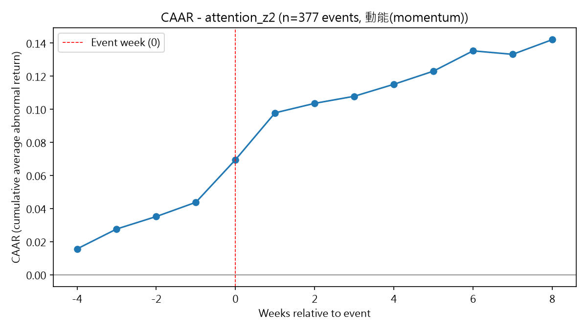
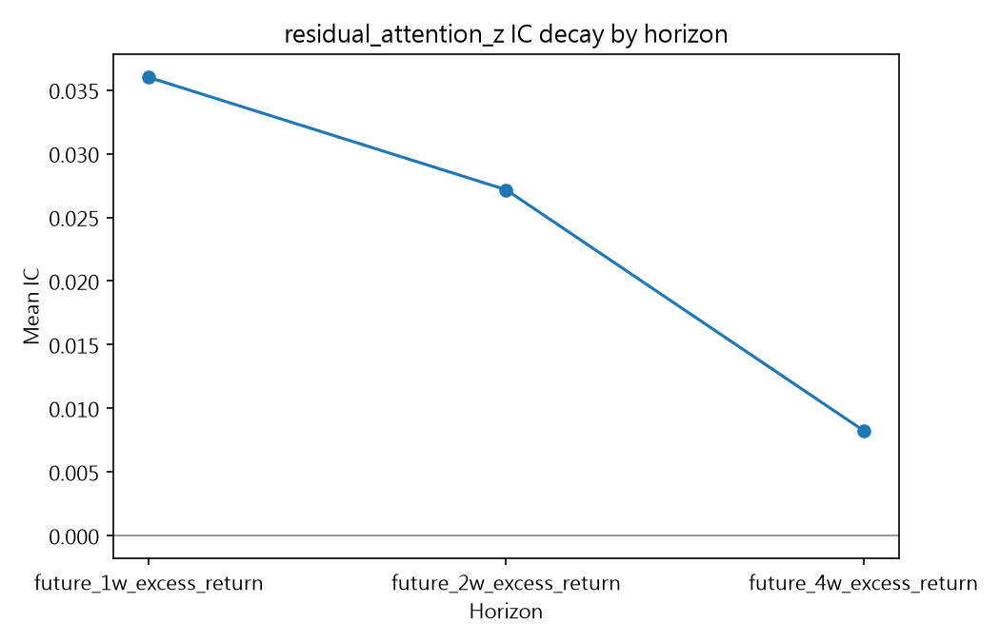
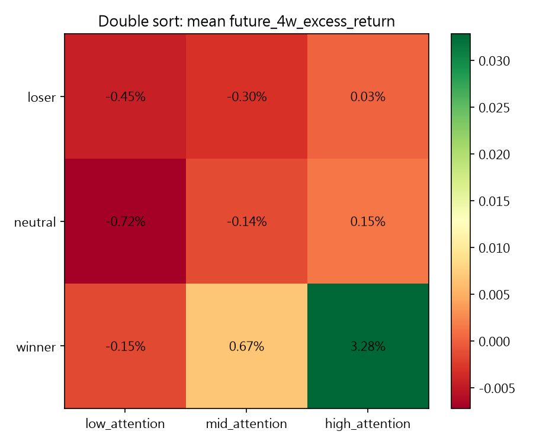
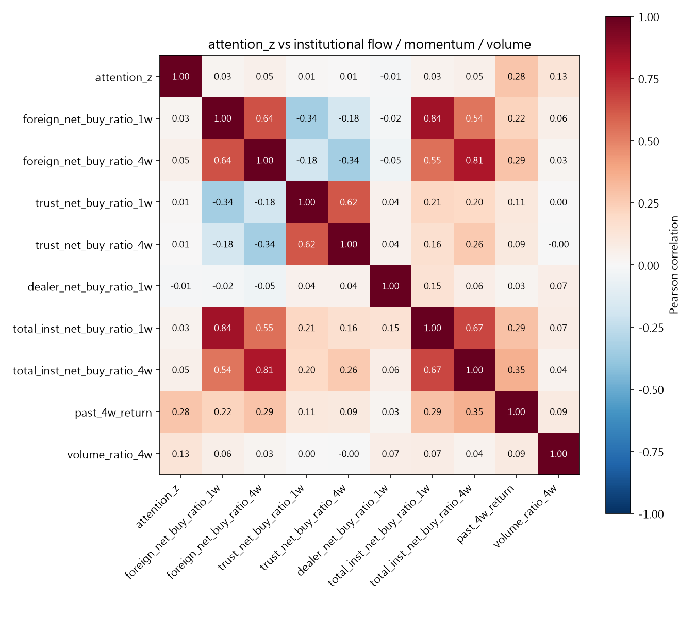
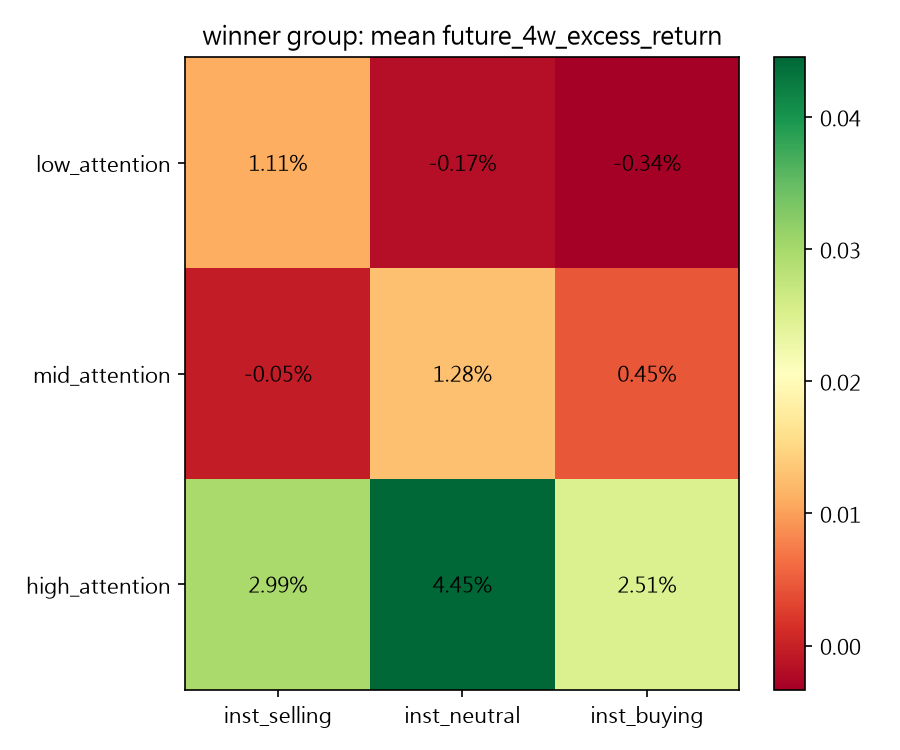
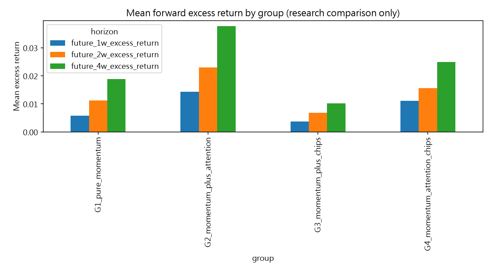

# Attention Meets Momentum: Google Trends Search Spikes, Institutional Flow, and Short-Term Continuation in Taiwan Stocks

*(中文版:[README_zh.md](README_zh.md))*

A one-page Chinese portfolio summary PDF is available here:
[Portfolio PDF Summary](exports/TAS_推甄作品集頁面.pdf)

**New here?** [`docs/PROJECT_EXPLAINED_SIMPLY.md`](docs/PROJECT_EXPLAINED_SIMPLY.md) has a
30-second / 3-minute / full-depth layered version of this whole page. If you want an
independent check of the methodology (look-ahead bias, alignment, overclaiming) rather than
just this project's own claims, see [`docs/RESEARCH_METHODOLOGY_AUDIT.md`](docs/RESEARCH_METHODOLOGY_AUDIT.md).

## 2. One-line Summary

Google search-volume spikes for Taiwanese large-cap stocks do not behave as
an independent predictive signal — they act as a **conditional amplifier of
existing price momentum**, and this pattern survives after controlling for
institutional (foreign/investment-trust/dealer) trading flows.

## 3. Key Finding

> Google Trends attention spikes do not behave as a standalone alpha
> signal. Instead, they act as a conditional momentum amplifier: past
> winner stocks with high search attention exhibit stronger short-term
> continuation. This effect remains after controlling for institutional
> trading flows, suggesting that the signal is not merely a proxy for
> foreign or institutional buying.

This conclusion was not the starting hypothesis — it is the end point of
three rounds of deliberately adversarial testing (see [Research
Evolution](#9-research-evolution) below), each designed to try to explain
away the previous round's result.

## 4. Why This Project Matters

Investor-attention research (Da, Engelberg & Gao 2011; deHaan, Lawrence &
Litjens 2024/2025; Barber, Huang, Odean & Schwarz 2022) is well established
for the US market. Public, reproducible tests on Taiwan's market — which
has a high retail-investor share and fast narrative/capital rotation — are
comparatively rare. This project builds a full, reproducible pipeline
(data collection → factor construction → event study → cross-sectional
regression → momentum/institutional-flow controls) and, just as
importantly, documents every attempt to falsify the initial positive
result before accepting it.

## 5. Research Question

Do abnormal spikes in Google search volume for a stock predict its
short-term (1–4 week) excess return over the market — and if so, is that
predictive power *independent* of price momentum and institutional trading
flow, or merely a reflection of one of them?

## 6. Data Sources

| Source | Content | Frequency | Period |
|---|---|---|---|
| Google Trends (`pytrends`) | Search Volume Index (SVI) for 50 large-cap TWSE tickers | Weekly | 2021-06 to 2026-06 |
| FinMind public REST API | Daily close price, volume, trading value; TAIEX benchmark | Daily | 2021-01 to 2026-07 |
| FinMind public REST API | Institutional investor (foreign / investment trust / dealer) buy-sell | Daily → aggregated weekly | 2021-01 to 2026-07 |

The 50-stock universe is documented in [`config/stock_list_50.csv`](config/stock_list_50.csv),
built around TWSE 0050-index-style large caps across semiconductors,
financials, shipping, telecom, and traditional industry.

**Note on the FinMind institutional data**: the free tier only exposes
buy/sell in **shares**, not NTD value. All "value" columns in this project
are share counts, not currency amounts — see
[`docs/limitations.md`](docs/limitations.md).

## 7. Methodology

1. **Attention factor**: `attention_z = (SVI - SVI_MA52) / SVI_STD52`,
   `attention_shock = SVI / SVI_MA52 - 1` — both self-normalized against each
   stock's own trailing 52-week history (cross-stock SVI scale is not
   directly comparable; see limitations).
2. **Event study (CAAR)**: [-4, +8]-week windows around attention-shock
   events, with a 4-week non-overlap filter and explicit calendar-clustering
   diagnostics.
3. **Cross-sectional IC / ICIR**: weekly Spearman rank correlation between
   the attention factor and forward excess returns.
4. **Fama-MacBeth regressions**: weekly cross-sectional OLS, aggregated
   across weeks, with an explicit fallback to a pooled two-way (stock+week)
   fixed-effects model with cluster-robust SEs where a literal per-week
   fixed-effects design is not statistically well-posed.
5. **Residual attention factor**: orthogonalize `attention_z` against
   momentum/volume/volatility/liquidity each week; re-test IC and CAAR on
   the residual.
6. **Double / triple sort**: independent-sort momentum × attention ×
   institutional flow terciles.
7. **Matched-sample event study**: nearest-neighbor matching on momentum,
   volume, and volatility to isolate the attention effect from observable
   confounders.

Full technical detail: [`docs/methodology.md`](docs/methodology.md).

## 8. Main Results

| Stage | Test | Result |
|---|---|---|
| v0.2 | CAAR, `attention_z>2` events | CAR@+8w = **+14.2%**, t=8.46 |
| v0.2 | IC/ICIR, `attention_z` | ICIR ≈ **0.31**, t≈4.8 |
| v0.2 | Group split by past return | Past winners: CAR=+30.8% (t=12.6); past non-winners: CAR=-1.1% (**not significant**, p=0.50) |
| v0.3 | Fama-MacBeth, momentum-controlled | Coefficient shrinks ~36% but stays significant (p<0.001) |
| v0.3 | Residual-factor IC | Significant at 1–2 weeks, **not significant at 4 weeks** (p=0.38) |
| v0.3 | Matched-sample (momentum/volume/vol-matched controls) | Event stocks still beat matched controls by **+1.7% to +3.7%** (1w–4w), p<0.0001, growing with horizon |
| v0.4 | Correlation, attention_z vs institutional flow | Max \|r\| = **0.05** (vs 0.28 for momentum) |
| v0.4 | Fama-MacBeth, +institutional flow controls | Coefficient barely moves (**~1% shrinkage**, still p<0.001) |
| v0.4 | Triple sort, winner bucket | High attention delivers +2.5% to +4.5% at 4w **regardless of institutional buying/selling direction** |

See [`docs/research_findings.md`](docs/research_findings.md) for the full numeric detail.

## 9. Research Evolution

This project is presented as a three-stage falsification process, not a
single positive result:

- **v0.2 — Initial attention effect**: constructed the attention factor on
  50 stocks and found significant CAAR and IC. [Full report](reports/TAS_v0.2_Result_Snapshot.md)
- **v0.3 — Momentum control**: tested whether the v0.2 result was just
  price momentum in disguise. Found a smaller but real residual effect,
  concentrated in stocks that had already risen ("past winners").
  [Full report](reports/TAS_v0.3_Momentum_Control_Report.md)
- **v0.4 — Institutional flow control**: tested whether foreign/investment-
  trust/dealer buying was the true driver behind both momentum and
  attention. Found institutional flow does **not** explain the effect away.
  [Full report](reports/TAS_v0.4_Final_Research_Interpretation.md)

A consolidated write-up across all three stages is available in the
[Final Research Report](reports/final_research_report.md).

## 10. Visual Results

| CAAR (naive attention events) | Residual-factor IC decay |
|---|---|
|  |  |

| Double sort: momentum × attention | Attention vs. institutional-flow correlation |
|---|---|
|  |  |

| Triple sort: winner-bucket heatmap | Strategy-group forward returns |
|---|---|
|  |  |

Additional figures and full data tables are in [`results/`](results/).

## 11. How to Reproduce

See [`docs/REPRODUCIBILITY_GUIDE.md`](docs/REPRODUCIBILITY_GUIDE.md) for a version of the
steps below annotated with what has actually been re-verified vs. what is transcribed from
this section without independent re-execution.

```bash
git clone <this-repo>
cd taiwan-attention-momentum-signal
python -m venv venv
source venv/bin/activate  # or venv\Scripts\activate on Windows
pip install -r requirements.txt

# Full pipeline (re-collects data from Google Trends + FinMind, then runs
# every analysis stage). Google Trends rate-limits aggressively; expect
# this to take 30-60+ minutes with retries.
python scripts/run_all.py

# Or run individual stages:
python scripts/run_data_collection.py
python scripts/run_event_study.py
python scripts/run_momentum_control.py
python scripts/run_institutional_flow_analysis.py
```

This repository ships a small illustrative sample
(`data/sample/attention_weekly_panel_sample.csv`, 3 stocks × 20 weeks) so
you can inspect the panel schema without re-running the full collection.
The full 50-stock dataset is **not** committed (see
[Limitations](#13-limitations)) — regenerate it via the scripts above,
which pull only from public APIs (Google Trends, FinMind).

## 12. Streamlit Demo

```bash
streamlit run app/streamlit_app.py
```

Four pages: data-collection overview, latest-week attention radar,
per-stock SVI/price lookup, and a summary of the research results above.
This is a research dashboard, not a trading terminal.

## 13. Limitations

- Google Trends normalizes each request's keywords to a shared 0–100
  scale; raw SVI is not directly comparable across separately-queried
  stocks (partially corrected via an anchor-keyword batching method — see
  `docs/limitations.md`).
- 50 large-cap stocks only; results should not be extrapolated to small
  caps, the full market, or non-Taiwan markets.
- Sample period (2021–2026) is momentum/bull-market-heavy; not tested
  across a full bear-market cycle.
- FinMind's free institutional-investor data provides share counts, not
  NTD trading value.
- Linear interaction terms (attention × momentum, attention × flow) were
  **not** statistically significant in the Fama-MacBeth regression, even
  though non-parametric double/triple sorts show a clear conditional
  pattern — the true interaction is likely non-linear/threshold-based, and
  this discrepancy is reported rather than hidden.
- This is a research artifact, not investment advice, and not a backtest
  of a tradable strategy net of costs, slippage, or short-sale constraints.

Full detail: [`docs/limitations.md`](docs/limitations.md).

## 14. References

1. deHaan, E., Lawrence, A., & Litjens, R. (2024/2025). *Measuring Investor
   Attention Using Google Search*. Management Science, 71(7), 6275–6297.
   https://doi.org/10.1287/mnsc.2022.02174
2. Barber, B. M., Huang, X., Odean, T., & Schwarz, C. (2022).
   *Attention-Induced Trading and Returns: Evidence from Robinhood Users*.
   Journal of Finance, 77(6), 3141–3190. https://doi.org/10.1111/jofi.13183
3. Szczygielski, J. J., Charteris, A., Bwanya, P. R., & Brzeszczyński, J.
   (2024). *Google search trends and stock markets: Sentiment, attention or
   uncertainty?* International Review of Financial Analysis, 91, 102549.
   https://doi.org/10.1016/j.irfa.2023.102549
4. Dong, D., Wu, K., Fang, J., Gozgor, G., & Yan, C. (2022). *Investor
   Attention Factors and Stock Returns: Evidence from China*. Journal of
   International Financial Markets, Institutions and Money, 77, 101499.
   https://doi.org/10.1016/j.intfin.2021.101499

## 15. Disclaimer

This repository is a research and educational project. It does not predict
stock prices, does not constitute a profitable trading strategy, and is
**not** an independent alpha factor — the central finding is the opposite
of that claim. Nothing here is investment advice. Past patterns in
back-tested data do not guarantee future results.
